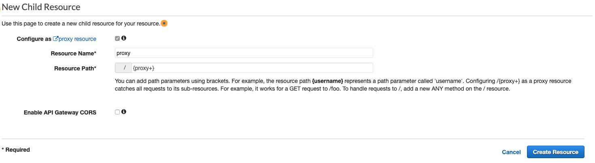
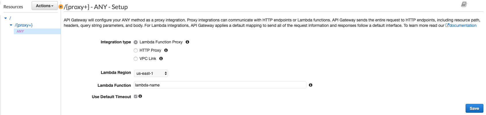
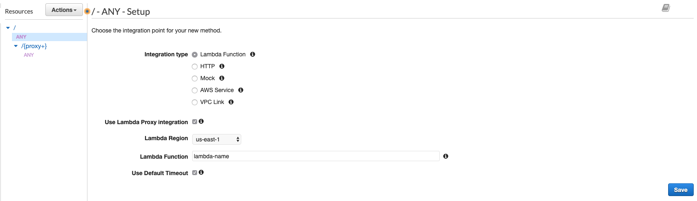

# AWS API Gateway configuration

You need to proxy all the requests to the lambda function.

To do that, you need to create both a resource and a method with AWS lambda proxy integration enabled.

See images below.

1. Create the resource 
1. Configure the resource
    1. Make sure the resource is all proxied to the lambda 
1. Configure a method
    1. Make sure `ANY` root entry points also go the the lambda 
